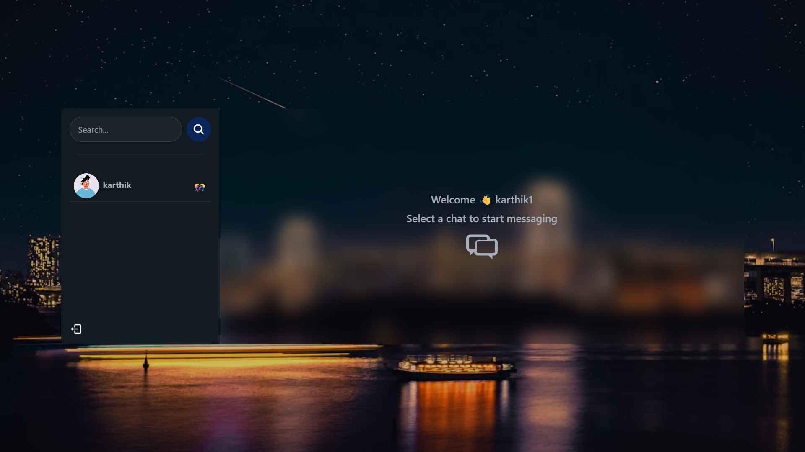

# MERN Chat App

A real-time chat application built with the **MERN stack** (MongoDB, Express, React, Node.js), featuring user authentication and private messaging.

## 🚀 Features

- **Real-Time Messaging**: Instant communication using Socket.IO.
- **User Authentication**: Secure login and registration with JWT.
- **Private and Group Chats**: Support for both private and group conversations.
- **Responsive Design**: Works seamlessly on all devices.
- **User Profiles**: Profile pages with avatars.
- **Message Notifications**: Real-time alerts for new messages.

## 🛠️ Tech Stack

- **Frontend**: React.js, Zustand (Global State), TailwindCSS, DaisyUI
- **Backend**: Node.js, Express.js, JWT Authentication
- **Database**: MongoDB (MongoDB Atlas)
- **Real-Time Communication**: Socket.IO

## 📦 Installation & Setup

### Prerequisites

- Node.js and npm installed
- MongoDB Atlas account with a cluster set up

### Clone the Repository

```bash
git clone https://github.com/karthikkharv/chat.git
cd chat
```

### Install Dependencies

```bash
# Install root dependencies
npm install

# Install frontend dependencies
cd frontend
npm install

# Install backend dependencies
cd ../backend
npm install
```

## ▶️ Run the Application

In separate terminals or using tools like concurrently, run the backend and frontend:

### Backend

```bash
cd backend
npm start
```

### Frontend

```bash
cd frontend
npm run dev
```

## 🖼️ Screenshots


